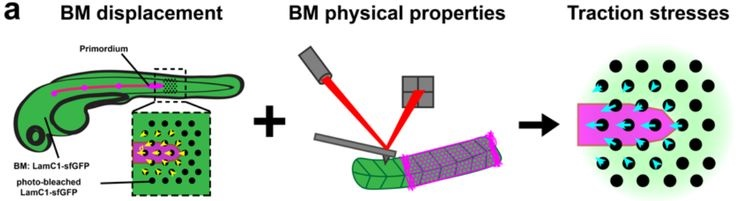
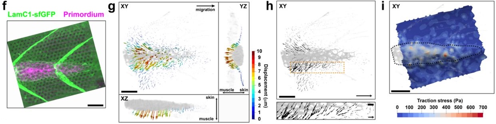

# A rear-engine drives adherent tissue migration *in vivo*

*Naoya Yamaguchi[^1], Ziyi Zhang[^2], Teseo Schneider[^3], Biran Wang[^4], Daniele Panozzo[^2], Holger Knaut[^1]*

[^1]: Skirball Institute of Biomolecular Medicine, New York University Grossman School of Medicine, New York, United States

[^2]: New York University, Courant Institute of Mathematical Sciences, New York 10003, USA

[^3]: University of Victoria, Canada

[^4]: Molecular Cytology Core Facility, Memorial Sloan Kettering Cancer Center

 

!!! abstract
    During animal embryogenesis, homeostasis and disease, tissues push and pull on their surroundings to move forward. Although the force-generating machinery is known, it is unknown how tissues exert physical stresses on their substrate to generate motion in vivo. Here, we identify the force transmission machinery, the substrate, and the stresses that a tissue, the zebrafish posterior lateral line primordium, generates during its migration. We find that the primordium couples actin flow through integrins to the basement membrane for forward movement. Talin/integrin-mediated coupling is required for efficient migration and its loss is partly compensated for by increased actin flow. Using Embryogram, an approach to measure stresses in vivo, we show that the primordium’s rear exerts high stresses, indicating that this tissue pushes itself forward with its back. This unexpected strategy likely also underlies the motion of other tissues in animals.

## Introduction

The ZebraFish software package contains custom-developed software for
the analysis of reference free 3D traction force images. The software
comprises of 3D marker detection and finite
element analysis in order to compute surface traction fields. Details on
the underlying algorithms are provided in the supplementary information.

The entire code is contained in `src/` folder. The ZebraFish binary is
in the `binary/` folder (there is no need to compile the code).

## Requirements

ZebraFish does not require any commercial software and was tested on
Windows 10 Enterprise and Mac OS X 10.14. The executable is not signed,
therefore on Mac it requires to enable the option to run untrusted
applications. The simplest way is to right click on ZebraFish, select
"open" and allow it to open in any subsequent dialogues. Note that you
might need to allow running apps from not coming from the apple store.
To do so, go to `System Preferences > Security & Privacy` the
General tab and click the `App Store and identified developers` radio
button (this step requires admin priviledges).

## Download

- [:page_facing_up: Paper on Biorxiv](https://www.biorxiv.org/content/10.1101/2021.08.03.454898v1.full).
<!-- - [:paperclip: Supplemental Material](paper/supplementary.pdf). -->
<!-- - [:notebook: User Documentation](usage.md). -->
<!-- - :computer: [Windows Executable], ⌘ [macOS Executable] -->
<!-- - [:open_file_folder: Source Code](https://github.com/zebrafishtfm/zebrafishtfm). -->

<!-- ## Citation  -->

## Acknowledgments

We thank R. Lehmann, L. Christiaen, D. Rifkin, M. Schober, J. Torres-Vázquez, W. Qian, P. Vagni, S. Lau and T. Colak-Champollion for critical comments, T. Gerson, T. Colak-Champollion and A. Feitzinger for reagents, T. Gerson, J. Proietti and S. Pirani for excellent fish care, N. Paknejad for advice on AFM, M. Cammer and Y. Deng for advice on microscopy, A. Liang, C. Petzold and K. Dancel-Manning for consultation and assistance with TEM work, and A. Ferrari and N. Chala for AFM consultation. The use of the NYULH DART Microscopy Laboratory (P30CA016087) and the Memorial Sloan Kettering Molecular Cytology Core Facility (P30 CA008748) is gratefully acknowledged. For providing the zebrafish knockout allele lamC1sa9866, we thank the Zebrafish International Resource Center (ZIRC). This work was supported by NIH grant NS102322 (H.K.), by an NYSTEM fellowship C322560GG (N.Y.), by an American Heart Association fellowship 20PRE35180164 (N.Y.), in part through the NYU IT High Performance Computing resources, services, and staff expertise, the NSF CAREER award 1652515 (D.N.), the NSF grants IIS-1320635 (D.N.), OAC-1835712 (D.N.), OIA-1937043 (D.N.), CHS-1908767 (D.N.), CHS-1901091 (D.N.), a gift from Adobe Research (D.N.), a gift from nTopology (D.N.), and a gift from Advanced Micro Devices, Inc (D.N.).