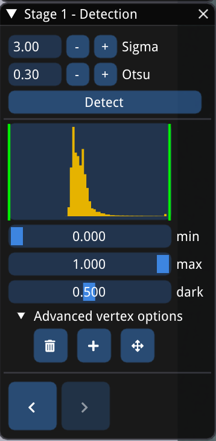

- `Sigma`: sigma for Gaussian fitting. Larger markers usually need a larger `Sigma`.
- `Otsu`: thresholding multiplier used in 2D marker detection algorithm.
- If the image is too bright or dark due to outlier brightness pixels, use the `min` and `max` slider as cutoff values. This modifies the image data and could facilitate subsequent steps.
- The `dark` slider has similar effects, but it only has to do with visualization and does not modify the image data.
- `Advanced vertex options`: manually delete, add or move vertices using your mouse.
