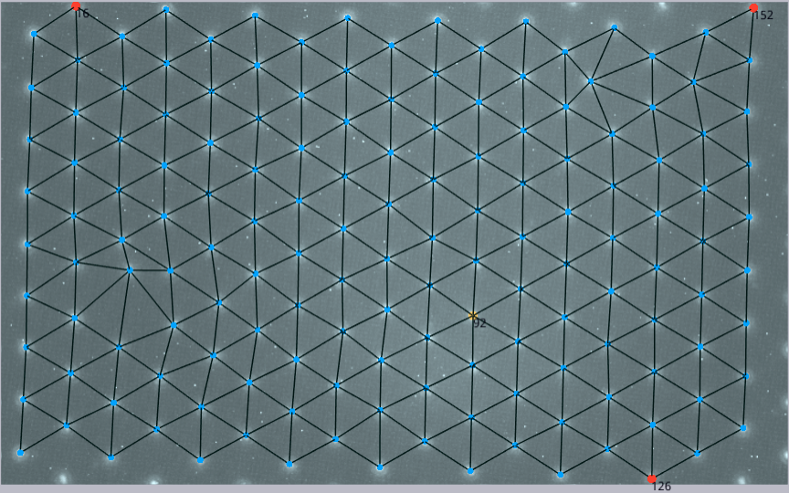
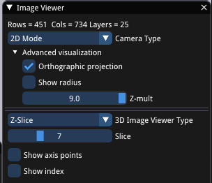
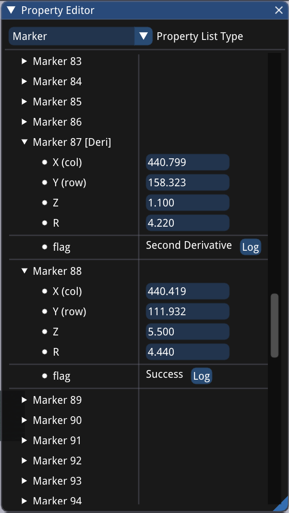

###	`Compute Bspline`

This could take a long time if the image is large. The lower-right window (`Image Viewer`) has info about your image stack shape. In this example the image is $451\times 734\times 25$ and will take 1~2 minutes to prepare.

It is highly suggested to crop the image to focus on the area of interest to save time and prevent using up all the memory.

### `Depth Search`

This is the step where we introduce the depth coordinate. Prior to this step the mesh is just a 2D flat thing.

Unfortunately, this step does not always succeed. ☹️

The depth search for most markers in the above figure is OK, but 

-  The red markers (index 16, 152, 126) indicate "depth search failure". There could be multiple reasons, but most likely “too close to boundary” which is indeed the case here.
-  The yellow markers (index 92) indicate "warning". The cause may be blurry images, random noise or “too close to search range”. Here if we take a look at the image, index 92 is best captured in the bottom z-slice out of 25 slices, which is problematic because its correct depth might be out of this image stack.

#### What do we do to fix them?
-	Change the Camera Type to “Two Axes”. It should give us a good intuition of what’s happening in 3D.
-	Change the 3D Image Viewer Type to “Z-Slice” and play around the `slice` slider. It is helpful to manually determine one marker’s correct depth.

-	Open `Window-Property Editor` under `View`, we can manually change the depth ($Z$-coordinate).

-	`Depth Search Refine` button under `Advanced Depth` runs depth search again based on the latest coordinates. It is highly suggested to click this button after any manual modification of the markers $XYZR$ information.

