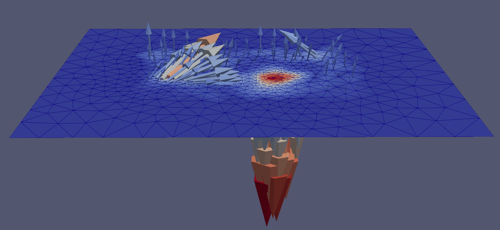

This is simply the result preview. Doing anything here does not affect the computed result.

The `displacement`, the 3x3 stress matrix and the computed `traction forces` have already been exported to the `VTU` files. There is no need to click the `Save` button.

***

Here is the detailed steps to visualize the vector field in `Paraview`:

-	Load the vtu file with ParaView.
-	Click `Apply changes to parameters automatically`. This saves us from clicking `Apply` every time.
-	Click the loaded vtu in the `Pipeline browser` to focus on it
-	Change colormap to `displacement` and visualization type to `Surface With Edges`
    - This controls what the flat mesh is showing
-	To view the vector field (displacement or traction force), when focused on the vtu file, click `Glyph`
-	Now click that new "glyph1" to focus on that
-	Change the `Orientation Array`, `Scale Array` and glyph1's `colormap` to “displacement”.