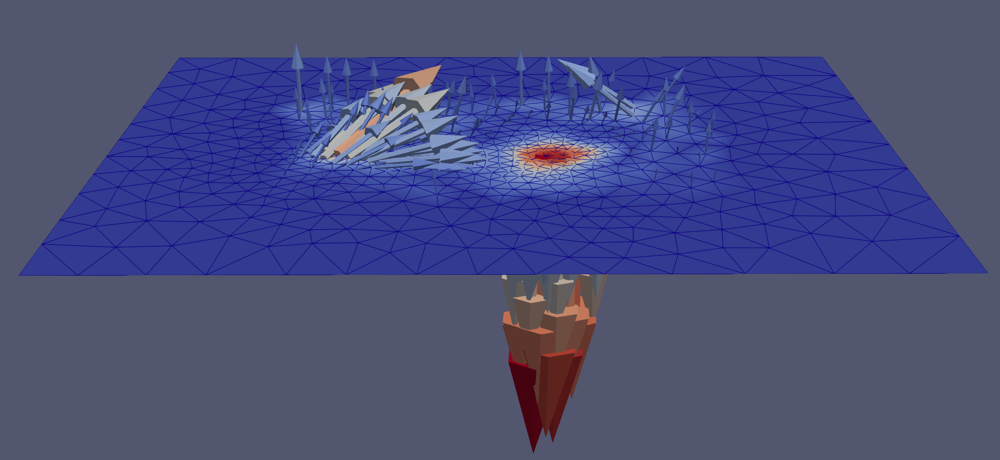

# Usage Instructions
This section explains the most important steps to calculate the traction forces for an image. For a detailed explanation of all the features, please check the `Interface Description` page.

## Marker Detection
After loading the image, the first step is 2D marker detection. If there is any mistake made by the auto-detection, it is possible to manually fix them (by mouse click deleting, adding and moving) in the second stage.  
At the end of marker detection, we only have markers' $XY$ information.

## Depth Search
This stage computes the $Z$-coordinate of the markers. The user needs to first click the `Compute Bspline` button. This step may take minutes if the image stack is large. Once the B-Spline control points are computed, the `Depth Search` button will pop up. It runs some optimization for each marker to decide an optimal $Z$-coordinate (or depth) for it.  
The optimization may not always succeed, for example when a marker is too close to the image stack border (in the image below, the depth of marker 87 has touched the bottom of the image stack), or the image itself is too blurry for the system to automatically make a decision. Our GUI can highlight such problematic markers with colors. We also provide multiple tools to fix such problems.

## Volumetric Mesh
Once we reach the fourth stage, the system will switch to another visualization to highlight the **displacements** of the markers as visualized in orange line segments. After this step, we no longer need to the original image stack any more.

By clicking `Build Volumetric Mesh`, the system will construct a tetrahedral mesh based on the old mesh. This volumetric mesh is not only a surface: it has its interior filled with tetrahedra. Padding is adopted by default so the volume may look larger.

## Results
The system will solve the underlying finite element model when reaching this stage. The user can preview the final results of either displacements or traction forces with interpolation.  
The result will automatically be exported to `{FileName}.vtu` at the same folder as the input image. It contains the `displacement`, the 3x3 stress matrix and the computed `traction forces`. There is no need to manually click the `save` button.

## Visualization
The final results are stored in a `VTU` file. One can read it with python for customized visualization or post data processing.  
Here we showcase one possible way to visualize the `displacement` in 3D vector fields with `Paraview`, a commercial visualization software.

